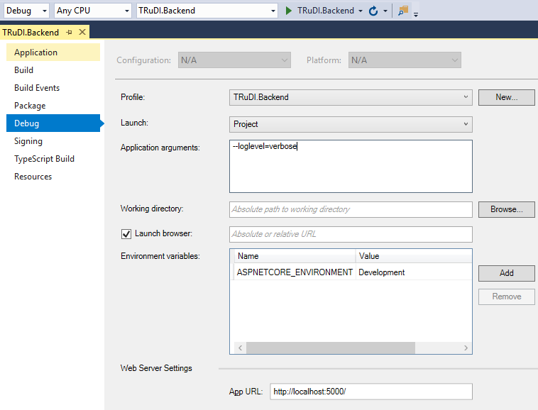

# TRuDI - Transparenz- und Display-Software

Ansprechpartner:

	Thomas Müller
	IVU Softwareentwicklung GmbH
	tmueller@ivugmbh.de

## Entwicklungsumgebung

### Microsoft .Net Core

- Visual Studio 2017 15.6: https://www.visualstudio.com/de/vs/
- .Net Core SDK 2.2.401: https://www.microsoft.com/net/core/
- Alternativ zu Visual Studio kann auch Visual Studio Code verwendet werden: https://code.visualstudio.com/

### Electron

- Node.js 8.11: https://nodejs.org/

### Build

Sind das .Net Core SDK sowie Node.js installiert, können die folgenden Build-Skripte zum erstellen der Installations-Pakete verwendet werden.

Die Installations-Pakete werden im Verzeichnis ``dist`` abgelegt. 

Die für Electron benötigten NPM-Pakete (www.npmjs.com) werden während des Build-Vorgangs herunter geladen. 
Es ist daher erforderlich, dass zumindest beim ersten (danach werden sie ggf. aus einem lokalen Cache geladen) 
eine Internet-Verbindung besteht oder ggf. die Proxy-Einstellungen von ``npm`` entsprechend angepasst werden.

#### Windows: src/build.cmd 
  
Erzeugt jeweils ein Installations-Paket für 32- und 64-Bit-Windows-System ab Windows 7.

Es ist möglich die Windows-Installer sowie die TRuDI.exe mit einem Code Signing-Zertifikat 
signieren zu lassen. Dazu müssen die Umgebungsvariablen ``CSC_LINK`` und ``CSC_KEY_PASSWORD`` definiert 
werden. ``CSC_LINK`` muss den Pfad zu einer PKCS#12-Datei mit dem Zertifikat und dem privaten Schlüssel enthalten.
``CSC_KEY_PASSWORD`` das Passwort für die PKCS#12-Datei.

#### Linux: src/build.sh

Erzeugt ein AppImage sowie ein DEB-Software-Paket.

Sollte es beim Build zu der Fehlermeldung ``"error NU1101: Unable to find package ILLink.Tasks"`` kommen, 
so muss in der Datei ``~/.nuget/NuGet/NuGet.Config`` das Verzeichnis ``private-packages`` 
unter ``packageSources`` aufgenommen werden.

## Installations-Pakete

Die aktuelle offiziell freigegebene Version von TRuDI ist **1.2.15**.

### Offizielle Download-Seite der PTB

Die jeweils aktuelle Version kann von der PTB-Seite unter folgenden Link heruntergeladen werden:

https://www.ptb.de/cms/de/ptb/fachabteilungen/abt2/fb-23/ag-234/info-center-234/trudi.html

## Dokumentation

[HAN-Adapter](doc/han-adapter.md)

[TAF-Adapter](doc/taf-adapter.md)

[Architektur-Dokumentation](doc/architecture-documentation.md)

[Erstellen eines Live Linux ISO-Image](doc/linux-live-image.md)

[Lieferanten-XML](doc/if_lieferant.md)

## Programm-Argumente von TRuDI

#### ``-l|--log <logfile>``

Datei in der Programmmeldungen protokolliert werden.

#### ``--loglevel <loglevel>``

Log Level: ``verbose``, ``debug``, ``info``, ``warning``, ``error``, ``fatal``. Standard ist ``info``.

#### ``-t|--test <testconfig>``

Aktiviert den Test-HAN-Adapter mit der angegebenen Konfigurationsdatei.

## Starten von TRuDI aus Visual Studio

Um TRuDI aus Visual Studio heraus zu starten, sind folgende Einstellungen auf der Seite Debug des Projekts TRuDI.Backend nötig:

- Launch: Project
- App URL: http://localhost:5000/

Wird TRuDI.Backend mit der Debug-Konfiguration kompiliert und gestartet, so wird immer der Port 5000 für die Webseite verwendet.
