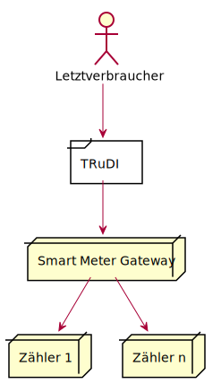
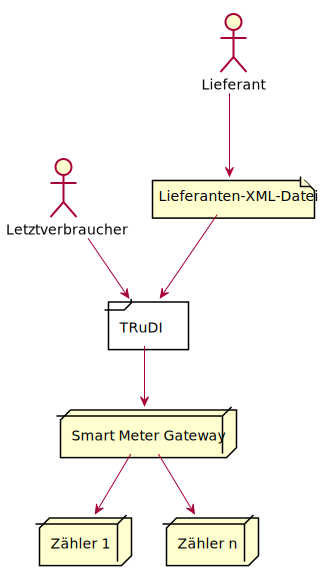
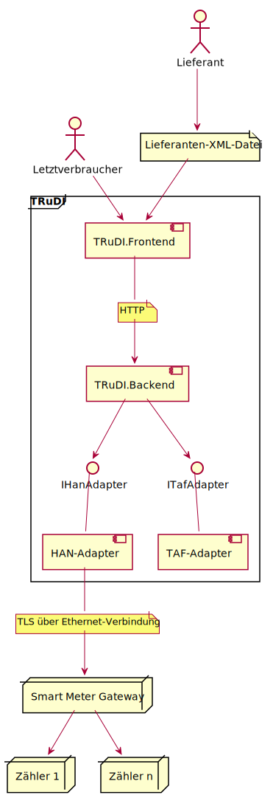
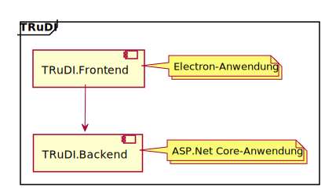
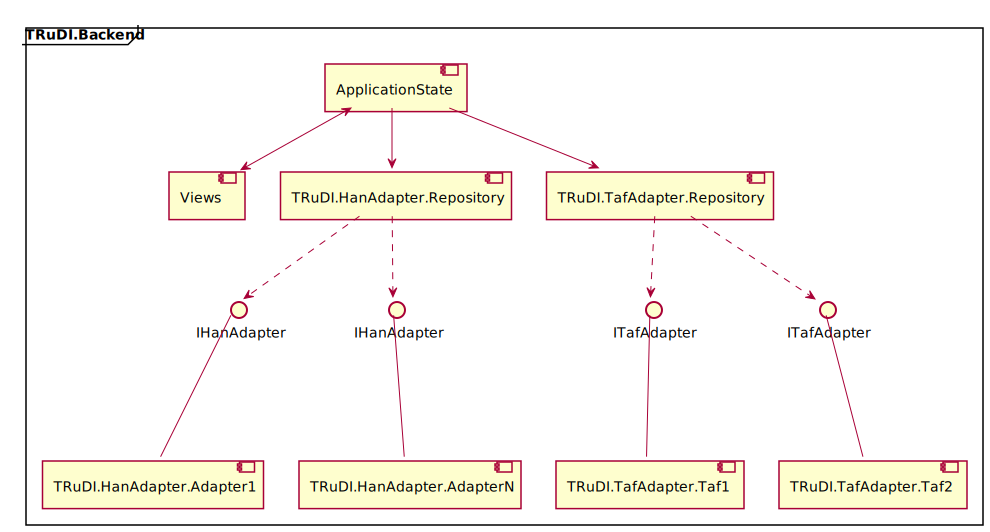
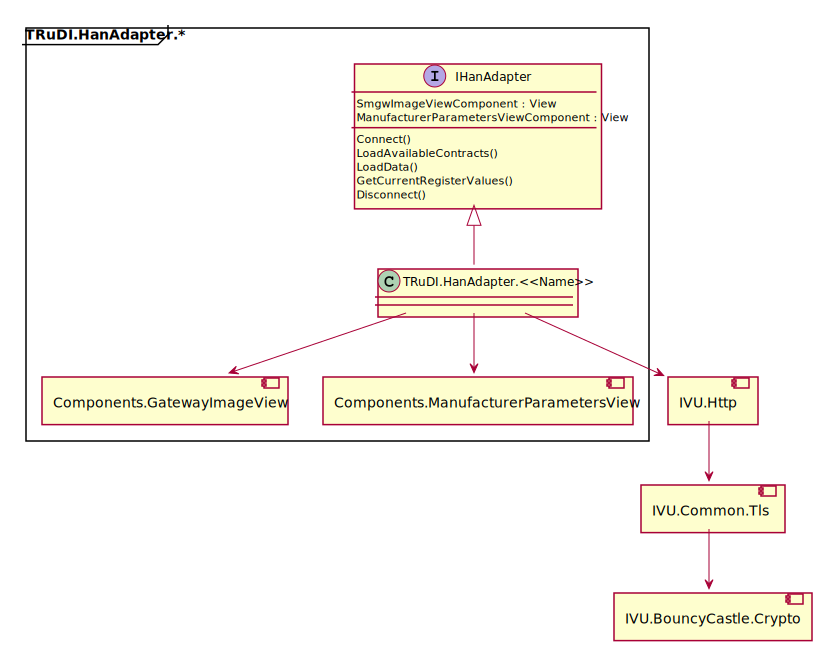
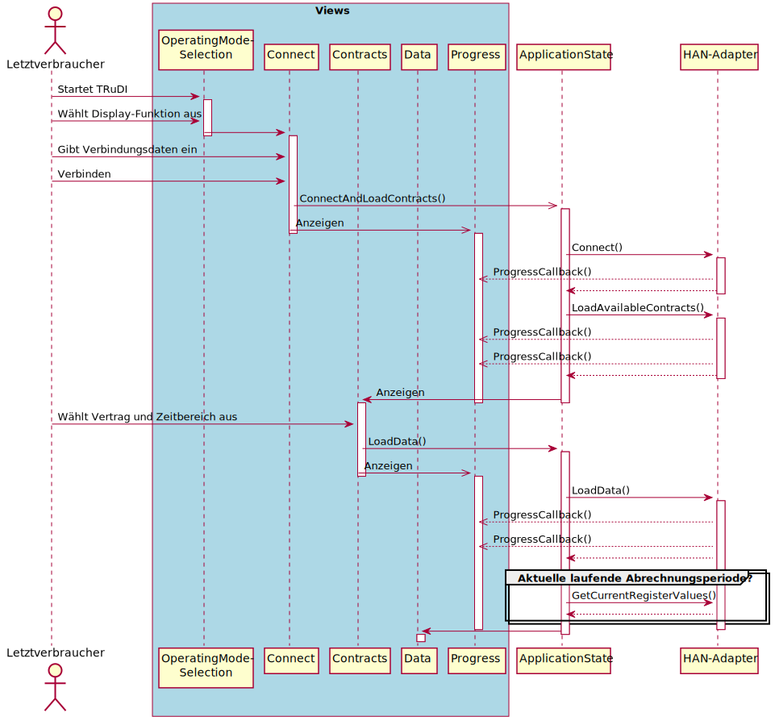
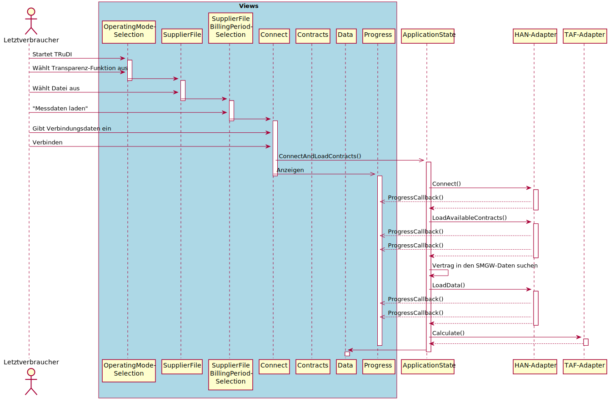

# TRuDI - Transparenz- und Display-Software

## Einführung und Ziele

Mit TRuDI (Transparenz- und Display-Software) stellt die Initiative Bundesdisplay 
eine herstellerübergreifende, standardisierte Visualisierungslösung bereit, welche 
die Anforderungen des MsbG (insbesondere §35, §62), der PTB-A50.8 erfüllt und 
die im Rahmen der Vorgaben des Bundesamts für Sicherheit in der Informationstechnik 
nutzbar ist. 

## Aufgabenstellung

Das Verfügbarmachen der Hilfsmittel zur Rechnungskontrolle ist Pflicht des 
Messwertverwenders (MessEG § 33 (3)). Mit TRuDI sorgt die Initiative BundesDisplay 
für ein als Rechnungsprüfungshilfsmittel geeignetes Software-Produkt. 
TRuDI kann dazu auf dem Computer des Letztverbrauchers genutzt werden. 

Die Lösung ist grundsätzlich Betriebssystem unabhängig. Zur Rechnungsprüfung kann 
auch eine bereitgestellte Live-Linux eingesetzt werden, die speziell als Systemumgebung 
zur Rechnungsprüfung konzipiert wurde. 

### Display-Funktion

Mittels der Display Funktion können Messwerte, die im SMGW vorhanden sind durch den 
Letztverbraucher zur Anzeige gebracht werden.

### Transparenz-Funktion

Im Rahmen dieses funktionalen Merkmals ist der Letztverbraucher mit Hilfe der Software 
in der Lage, Tarifrechnungen, die auf Basis der Messwerte des SMGWs in der Systemlandschaft 
des Lieferanten durchgeführt hat lokal nachzuvollziehen und damit seine Rechnung zu 
überprüfen. 

## Stakeholder

Rolle | Beschreibung | Erwartungshaltung                 
-- | -- | -- 
Arbeitskreis Bundesdisplay | Initiative der PTB und der SMGW-Hersteller | Bereitstellung einer standardisierten Anzeige
PTB (Arbeitsgruppe 8.51 Metrologische Software) | Nationale Metrologie-Institut der Bundesrepublik Deutschland | Prüfung der Software nach PTB-A 50.8 Abschnitt 5 und 7
Letztverbraucher | | Erhält eine einheitliche, herstellerübergreifende Visualisierung seiner Verbrauchsdaten
SMGW-Hersteller | | Bereitstellung von Adaptern für den Zugriff HAN-Schnittstelle des jeweiligen SMGW

## Randbedingungen

### Technische Randbedingungen

Rolle | Erläuterungen, Hintergrund                  
-- | -- 
Betrieb auf Linux- und Windows-Desktop-Betriebsystemen | Die Software muss unter Windows ab Version 7 lauffähig sein. Zusätzlich muss die Software auch unter Linux lauffähig sein, um ein Live-Medium (CD/DVD oder USB-Stick) auf Linux-Basis erstellen zu können. Unterstützung von Mac OS X ist wünschenswert, aber nicht zwingend erforderlich. 

## Kontextabgrenzung

### Fachlicher Kontext

#### Display-Funktion

Komponente | Beschreibung
-- | --
Letztverbraucher |  Der Letztverbraucher, welcher sich über seinen Energieverbrauch informieren will.
TRuDI | TRuDI als Anzeigeprogramm um die aktuellen sowie historischen Zählerdaten zur Anzeige zu bringen.
Smart Meter Gateway | Sammelt in festgelegten Intervallen die Daten von den angeschlossenen Zählern ein. Nimmt ggf. eine Tariffierung basierend auf dem jeweils eingestellten Tarifanwendungsfall (TAF) vor und leitet die Daten zum Lieferanten zur Abrechnung weiter.
Zähler | Ein oder mehrere Zähler für unterschiedliche Energiearten (Strom, Gas, Wasser, Wärme, etc.)

#### Transparenz-Funktion

Komponente | Beschreibung
-- | --
Letztverbraucher | Der Letztverbraucher, welcher die Korrektheit seiner Verbrauchsabrechnung prüfen will.
Lieferant | Vertragspartner des Letztverbrauchers. Dieser nimmt die Tarifbildung in seinem Rechenzentrum vor.
Lieferanten-XML-Datei | Datei welche die Informationen zu den Tarifschaltzeiten für eine Abrechnungsperiode beschreibt.
TRuDI | TRuDI holt auf Basis der Lieferanten-XML-Datei die entsprechenden Daten aus dem Smart Meter Gateway ab und rechnet die Tarife nach. Das Ergebnis wird dem Letztverbraucher zur Anzeige gebracht.
Smart Meter Gateway | Sammelt in festgelegten Intervallen die Daten von den angeschlossenen Zählern ein. Leitet regelmäßig die erfassten Messwerte an den Lieferanten weiter.
Zähler | Ein oder mehrere Zähler für unterschiedliche Energiearten (Strom, Gas, Wasser, Wärme, etc.)

### Technischer Kontext

Komponente | Beschreibung
-- | --
HAN-Adapter | Die Kommunikation mit dem SMGW erfolgt mittels eines HAN-Adapters. Dieser Implementiert das jeweilige herstellerspezifische Kommunikations-Protokoll. Er liefert die Messwerte und Logmeldungen zu einen Angefragten Zeitpunkt als XML-Datei nach VDE AR E 2418-6 zurück.
Lieferanten-XML-Datei | Datei welche die Informationen zu den Tarifschaltzeiten für eine Abrechnungsperiode beschreibt. Diese kann vom Letztverbraucher z.B. über ein Kundenportal des jeweiligen Lieferanten heruntergeladen werden.

## Lösungsstrategie

TRuDI wird hauptsächlich in C# auf der Basis von [ASP.Net Core](https://www.asp.net/) implementiert. Für eine Plattformübergreifende darstellung der Benutzeroberfläche sowie zur Erstellung von Installationspaketen für die jeweilige Zielplattform wird das [Electron-Framework](https://electronjs.org/) verwendet.

## Bausteinsicht

### Whitebox Gesamtsystem

#### TRuDI.Frontend
- Verwendet das [Electron-Framework](https://electronjs.org/)
- Stellt das Browser-Fenster zur Anzeige der Benutzeroberfläche bereit
- Startet TRuDI.Backend
- Führt einen Integritätstest über alle relevanten Dateien durch
 
#### TRuDI.Backend 
- [ASP.Net Core](https://www.asp.net/)-Anwendung, welche die eigentliche Anwendungs-Logik enthält.

### Whitebox TRuDI.Backend

#### TRuDI.HanAdapter.Repository

Führt eine Liste der verfügbaren HAN-Adapter.

#### TRuDI.HanAdapter.*

HAN-Adapter stellen die Verbindung zwischen einem Smart Meter Gateway und TRuDI her. 

#### TRuDI.TafAdapter.Repository

Führt eine Liste der verfügbaren TAF-Adapter.

#### TRuDI.TafAdapter.Taf1

Adapter zur TAF-1-Berechnung aus einer originären Messwertliste.

#### TRuDI.TafAdapter.Taf2

Adapter zur TAF-1-Berechnung aus einer originären Messwertliste.

#### Views

Es sind folgende Views mit dazugehörigen Controllern definiert:

### Whitebox TRuDI.HanAdapter.*

#### TRuDI.HanAdapter.\<\<Name>>

Der HAN-Adapter, welcher die Kommunikation mit dem SMGW übernimmt und ggf. die empfangenen Daten auf das Format der VDE AR E 2418-6 konvertiert. "\<\<Name>>" steht hierbei für den Namen des SMGW-Herstellers (ggf. abgekürzt).

#### Components.GatewayImageView

ASP .Net View-Komponente mit welcher das SMGW-Bild angezeigt wird.

#### Components.ManufacturerParametersView

ASP .Net View-Komponente mit welcher es ermöglicht wird, weitere Parameter für den Verbindungsaufbau zum Smart Meter Gateway vom Benutzer eingeben zu lassen.

#### IVU.Http

Fork der HttpClient-Klasse aus den .Net Core Foundation Libraries. 

#### IVU.Common.Tls

TLS-Bibliothek welche von IVU.Http verwendet wird um Plattformübergreifend die von der TR-03109-1 geforderten Cipher Suites bereit zu stellen. 

#### IVU.BouncyCastle.Crypto

Die von IVU.Common.Tls verwendete Crypto-Library. Fork von [Bouncy Castle Crypto Package For C Sharp](https://github.com/bcgit/bc-csharp).

## Laufzeitsicht

### Ablauf Display-Funktion

### Ablauf Transparenzfunktion

## Verteilungsschicht

Für die Software werden mittels [electron-builder](https://www.npmjs.com/package/electron-builder) folgende Installations-Pakete bereitgestellt:

Typ | Zielplattform | Besonderheiten
-- | -- | --
nsis (Nullsoft Scriptable Install System) | Windows | 
deb (Debian Package) | Linux | für Debian-Basierte Systeme
AppImage | Linux | enthält alle nötigen Abhängigkeiten und sollte unter diversen Linux-Distributionen lauffähig sein

Im jeweiligen Installations-Paket ist die benötigte .Net Core Runtime bereits enthalten.

Unter Windows kann die Software ohne Administrator-Rechte installiert werden.
Unter Linux kann das AppImage-Paket direkt ohne Installation gestartet werden.

## Konzepte

### Benutzeroberfläche

Die Benutzeroberfläche wird mittels HTML und Javascript (generiert durch [ASP.Net Razor](https://en.wikipedia.org/wiki/ASP.NET_Razor)) im Browser-Fenster (Chromium) des [Electron-Frameworks](https://electronjs.org/) dargestellt. Dadurch ergibt sich für jede unterstützte Plattform ein einheitliches Aussehen der Benutzeroberfläche.

### Start der Anwendung

Das [Electron-Framework](https://electronjs.org/) beginnt mit der Programm-Ausführung in der Datei TRuDI.Frontend\main.js. Hier wird das Browser-Fenster geöffnet und die Backend-Anwendung (TRuDI.BackEnd.exe) gestartet.

TRuDI.BackEnd gibt nach erfolgreicher Initialisierung den Port, über welchen der Integrierte HTTP-Server erreichbar ist, über eine Konsolen-Meldung an main.js weiter. Daraufhin wird die Startseite von TRuDI.Backend (die Betriebsart-Auswahl) geladen.

### Logging

TRuDI.Backend verwendet für das Logging [Serilog](https://serilog.net/).

Innerhalb der von TRuDI verwendeten Komponenten wird [LibLog](https://github.com/damianh/LibLog) verwenden. LibLog ist eine Abstraktionsschicht, welche mehrere Logging-Bibliotheken unterstützt (z.B. Log4Net, NLog oder Serilog).

Für das Logging sind Kommandozeilen-Parameter vorhanden, mittels derer das Log-Level sowie eine Log-Datei angegeben werden kann:

Parameter | Beschreibung
-- | --
-l logfile, --log logfile | Datei in welche Log-Meldungen geschrieben werden sollen
--loglevel level | Log Level: verbose, debug, info, warning, error, fatal. Standard ist info.

## Glossar

Begriff | Definition
-- | --
Smart Meter Gateway, SMGW | Zentrale Kommunikationseinheit eines intelligenten Messsystems, welches nach den Vorgaben des Bundesamt für Sicherheit in der Informationstechnik entwickelt wurde.
Lieferant | Das Energieversorgungsunternehmen, mit dem der jeweilige Letztverbraucher einen Liefervertrag abgeschlossen hat.
Letztverbraucher | Der letztendliche Anwender der TRuDI. Dieser steht in einem Vertragsverhältnis mit einem Lieferanten.
VDE AR E 2418-6 | Anwendungsregel, welche die XML-Schnittstelle zur Übertragung von Messwerten und Logmeldungen beschreibt.
HAN-Schnittstelle | Die HAN-Schnittstelle (Home Area Network) ist als Ethernetschnittstelle ausgeführt und dient zur Einbindung des Smart Meter Gateways ins Heimnetz des Letztverbrauchers.
Herstellerübergreifende Identifikationsnummer | Eine Gerätenummer nach DIN 43863-5, z.B. "E XXX 0012345678", wobei XXX für die jeweilige Herstellerkennung steht
