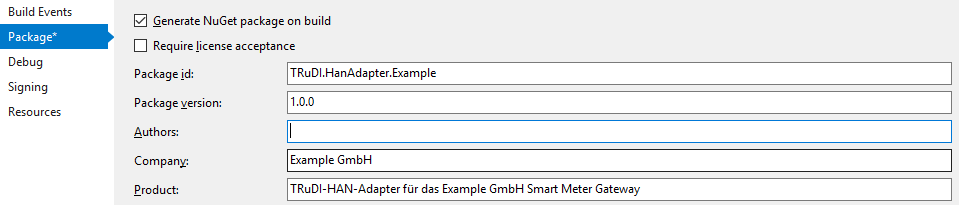

# TRuDI-HAN-Adapter

## Erstellen eines neuen HAN-Adapters

Ein neues Projekt soll der Projektmappe hinzugefügt werden. Als Zielframework muss .NET Core 2.0 ausgewählt werden. Als Projekttyp soll Klassenbibliothek ausgewählt werden.

### Namenskonvention HAN-Adapter

Der Projektname soll nach folgendem Schema gebildet werden: ``TRuDI.HanAdapter.<Adaptername>``.

Dabei ist `"<Adaptername>"` durch den gewünschten Namen des Gateway-Herstellers zu ersetzten.
Es können z.B. die 3 Buchstaben der FLAG Hersteller ID verwendet werden, aber auch der vollständige Herstellername ist gültig.

Assemblies müssen folgendermaßen benannt werden (analog zum Projektnamen), z.B.:

```csharp
TRuDI.HanAdapter.<Adaptername>
```

Die Klasse, welche das Interface IHanAdapter impelmentiert, muss wie folgt benannt werden (ebenfalls wieder wie der Projektname):

```csharp
namespace TRuDI.HanAdapter.<Adaptername>
{
   public class HanAdapter<Adaptername> : IHanAdapter
   {
      // ...
   }
}
```

### Abhängigkeiten und NuGet Pakete

Eine Externe NuGet Paketquelle muss zum Projekt hinzugefügt werden. 
Als Quelle wird der Ordner ``private-packages`` aus dem Repository verwendet.

Es müssen auch Verweise auf Projekte ``TRuDI.HanAdapter.Interface``, ``TRuDI.Models`` und ``IVU.Http`` hinzugefügt werden.

Außerdem müssen auch die öffentliche NuGet Pakete 
- ``Microsoft.AspNetCore.All`` 
- ``Newtonsoft.Json`` 
 
dem Projekt hinzugefügt werden.

### Beispiel-Projekt-Datei

```xml
<Project Sdk="Microsoft.NET.Sdk">

  <PropertyGroup>
    <TargetFramework>netcoreapp2.0</TargetFramework>
  </PropertyGroup>

  <PropertyGroup>
    <!-- Pfade zum Verzeichnis private-packages an-->
    <RestoreSources>$(RestoreSources);../../private-packages;https://api.nuget.org/v3/index.json</RestoreSources>
    <PackageOutputPath>..\..\private-packages</PackageOutputPath>

    <!-- NuGet-Paket beim Build erstellen: true -->
    <GeneratePackageOnBuild>true</GeneratePackageOnBuild>

    <!-- Nach Änderungen am Adapter muss die Versions-Nummer entsprechend angepasst werden: -->
    <Version>1.0.0</Version>
    
    <!-- Diese Angaben sollten entsprechend angepasst werden: -->
    <Company>Hersteller-Name</Company>
    <Authors>Hersteller-Name</Authors>
    <Product>TRuDI-HAN-Adapter für Produktname des Herstellers</Product>
  </PropertyGroup>

  <!-- Für das Logging wird LibLog (siehe unten) verwendet: LIBLOG_PORTABLE muss hierzu definiert werden: -->
  <PropertyGroup Condition="'$(Configuration)|$(Platform)'=='Debug|AnyCPU'">
    <DefineConstants>TRACE;DEBUG;NETCOREAPP2_0;LIBLOG_PORTABLE</DefineConstants>
  </PropertyGroup>

  <PropertyGroup Condition="'$(Configuration)|$(Platform)'=='Release|AnyCPU'">
    <DefineConstants>TRACE;RELEASE;NETCOREAPP2_0;LIBLOG_PORTABLE</DefineConstants>
  </PropertyGroup>

  <!-- Hier ist <Adaptername> entsprechend zu ersetzten (und die Dateien natürlich auch anzulegen)! -->
  <ItemGroup>
    <EmbeddedResource Include="Content\bild_vom_smgw.jpg" />
    <EmbeddedResource Include="Views\Shared\Components\GatewayImage<Adaptername>View\Default.cshtml" />
  </ItemGroup>
  
  <!-- Hier werden die benötigten Nuget-Pakete eingebunden: -->
  <ItemGroup>
    <PackageReference Include="Microsoft.AspNetCore.All" Version="2.0.3" />
    <PackageReference Include="Newtonsoft.Json" Version="10.0.3" />
  </ItemGroup>
  
  <ItemGroup>
    <ProjectReference Include="..\IVU.Http\IVU.Http.csproj" />
    <ProjectReference Include="..\TRuDI.HanAdapter.Interface\TRuDI.HanAdapter.Interface.csproj" />
    <ProjectReference Include="..\TRuDI.Models\TRuDI.Models.csproj" />
  </ItemGroup>

</Project>
```

### Ordnerstruktur

Hier kann das Projekt ``TRuDI.HanAdapter.Example`` als Beispiel genommen werden.

```
Projektverzeichnis (TRuDI.HanAdapter.<Adaptername>)
|
+- Components
|  
+- Content
|
+- Views
   |
   +- Shared
      |
      +- Components
         |
         +- GatewayImage<Adaptername>View
```

In den Ordner ``Content`` muss das Bild des Smart Meter Gateways als PNG-Datei in der Auflösung von mind. 320 x 320 Pixel als eingebettete Ressource angelegt werden.
Dem Ordner ``GatewayImage<Adaptername>View`` soll die View-Datei ``Default.cshtml`` mit foldendem Inhalt hinzugefügt werden:

```xml
<div>
    .png" class="img-responsive"/>
</div>
```

Dem Ordner ``Components`` sollen zwei Klassendateien hinzugefügt werden: ``GatewayImage<Adaptername>View.cs`` und ``GatewayImage<Adaptername>ViewModel.cs``. Der Inhalt dieser Dateien kann 
aus entsprechenden Dateien im Projekt ``TRuDI.HanAdapter.Example`` entnommen werden.

### IHanAdapter Schnittstelle

Die Zentrale Klasse des HAN.Adapters ``HanAdapter<AdapterName>`` muss die Schnittstelle ``IHanAdapter`` implementieren.
Dabei kann das Property ``SmgwImageViewComponent`` wie folgt implementiert werden:

```csharp
public Type SmgwImageViewComponent => typeof(GatewayImageMfcView);
```

Das Property ``ManufacturerParametersViewComponent`` kann ``null`` zurück liefern: 
Diese View-Komponente wird nur dann verwendet, wenn ein Smart Meter Gateway spezielle zusätzliche 
Parameter (z.B. für den Verbindungsaufbau) benötigt.

## Einbinden des neuen HAN-Adapters

Der HAN-Adapter soll wie folgt in die TRuDI Anwendung eingebunden werden.
In der Klasse (Projekt TRuDI.HanAdapter.Repository)

```csharp
TRuDI.HanAdapter.Repository.HanAdapterRepository
```

muss der neue HAN-Adapter in die Liste ```availableAdapters``` eingetragen werden, z.B.: 

```csharp
new HanAdapterInfo("MFC", "Beispiel GmbH", typeof(HanAdapterMfc)),
```

Während der Entwicklung des HAN-Adapters kann dieser als Projekt-Referenz in das Projekt TRuDI.HanAdapter.Repository.csproj aufgenommen werden:

```xml
  ...
  <ItemGroup>
    <ProjectReference Include="..\TRuDI.HanAdapter.Example\TRuDI.HanAdapter.Example.csproj" />
  </ItemGroup>
```

Die spätere Integration erfolgt als NuGet-Paket. Beispiel für die entsprechenden Projekt-Einstellungen:


Die NuGet-Pakete der HAN-Adapter werden im Verzeichnis private-packages abgelegt.


## HTTPS

Für den Zugriff auf die Gateways über HTTPS stellt die IVU Softwareentwicklung eine TLS-Bibliothek sowie einen HTTP-Client zur verfügung.
Diese Komponenten gewährleisten die geforderte TLS-Funktionalität unter allen zu unterstüzenden Plattformen. 

Es werden folgende Cipher Suites unterstützt:
- TLS_ECDHE_ECDSA_WITH_AES_128_CBC_SHA256
- TLS_ECDHE_ECDSA_WITH_AES_256_CBC_SHA384
- TLS_ECDHE_ECDSA_WITH_AES_128_GCM_SHA256
- TLS_ECDHE_ECDSA_WITH_AES_256_GCM_SHA384

Elliptische Kurven:
- Brainpool P256r1
- Brainpool P384r1
- Brainpool P512r1
- NIST P-256
- NIST P-384

Die HTTP-Client-Klasse basiert auf der Version aus den .Net Core Foundation Libraries: https://msdn.microsoft.com/en-us/library/system.net.http.httpclient

Die NuGet-Pakete sind im Verzeichnis "private-packages" zu funden. Dieses Verzeichnis ist in den Beispiel-Projekten auch als Paket-Quelle angegeben.

## Logging

Zum Logging innerhalb des Adapters empfehlen wir LibLog zu verwenden: https://github.com/damianh/LibLog 

Die Ausgabe der Log-Meldungen übernimmt dadurch der Logger im aufrufenden Programm. 
In TRuDI wird hierzu Serilog (https://serilog.net/) verwendet.

## HAN-Adapter-Test-Programm

Das Projekt TRuDI.HanAdapter.Test dient als Test-Programm für die HAN-Adapter. Damit können diese über die Kommandozeile aufgerufen werden.

```
TRuDI HAN Adapter Test Application

Usage: TRuDI.HanAdapter.Test [options] [command]

Options:
  -?|-h|--help               Show help information
  -l|--log <log-file>        Logmeldungen werden in die angegebene Datei geschrieben.
  --log-console              Logmeldungen werden auf der Konsole ausgegeben.
  --loglevel <log-level>     Log Level: verbose, debug, info, warning, error, fatal. Standard ist info.
  -t|--test <test-config>    Aktiviert den Test-HAN-Adapter mit der angegebenen Konfigurationsdatei.
  -o|--output <output-file>  Ausgabedatei.

Commands:
  adapter-list       Generiert eine List mit allen bekannten HAN-Adaptern.
  contract-list      Liest die Liste der für den Benutzer verfügbaren Verträge aus dem SMGW.
  current-registers  Liest die aktuellen Registerwerte für den angegebenen Vertrag aus dem SMGW.
  load-data          Liest die Daten des angegebenen Vertrags aus dem SMGW.

Use "TRuDI.HanAdapter.Test [command] --help" for more information about a command.
```

```
Usage: TRuDI.HanAdapter.Test contract-list [options]

Options:
  --help|-h|-?         Show help information
  --user <username>    Benutzername
  --cert <cert-file>   PKCS#12-Datei mit Client-Zertifikat und dazugehörigen Key
  --pass <password>    Passwort zum Benutzernamen oder ggf. für die PKCS#12-Datei.
  --id <serverid>      Herstellerübergreifende ID des SMGW (z.B. "EABC0012345678")
  --addr <address>     IP-Adresse des SMGW.
  --port <port>        Port des SMGW.
  --timeout <timeout>  Timeout in Sekunden nachdem der Vorgang über das CancellationToken abgebrochen wird.
```

```
Usage: TRuDI.HanAdapter.Test load-data [options]

Options:
  --help|-h|-?                   Show help information
  --user <username>              Benutzername
  --cert <cert-file>             PKCS#12-Datei mit Client-Zertifikat und dazugehörigen Key
  --pass <password>              Passwort zum Benutzernamen oder ggf. für die PKCS#12-Datei.
  --id <serverid>                Herstellerübergreifende ID des SMGW (z.B. "EABC0012345678")
  --addr <address>               IP-Adresse des SMGW.
  --port <port>                  Port des SMGW.
  --timeout <timeout>            Timeout in Sekunden nachdem der Vorgang über das CancellationToken abgebrochen wird.
  --usagepointid <usagePointId>  Zählpunktsbezeichnung (optional)
  --tariffname <tariffName>      Identifikation des Tarifs
  --billingperiod <index>        Index der Abrechnungsperiode (bei TAF-7 nicht benötigt)
  --start <start>                Zeitstempel, formatiert nach ISO8601
  --end <end>                    Zeitstempel, formatiert nach ISO8601
  --skip-validation              XML-Validierung nicht durchführen
  --taf6                         TAF-6-Abrechnungsperiode verwenden (nicht bei TAF-7)
```

```
Usage: TRuDI.HanAdapter.Test current-registers [options]

Options:
  --help|-h|-?                   Show help information
  --user <username>              Benutzername
  --cert <cert-file>             PKCS#12-Datei mit Client-Zertifikat und dazugehörigen Key
  --pass <password>              Passwort zum Benutzernamen oder ggf. für die PKCS#12-Datei.
  --id <serverid>                Herstellerübergreifende ID des SMGW (z.B. "EABC0012345678")
  --addr <address>               IP-Adresse des SMGW.
  --port <port>                  Port des SMGW.
  --timeout <timeout>            Timeout in Sekunden nachdem der Vorgang über das CancellationToken abgebrochen wird.
  --usagepointid <usagePointId>  Zählpunktsbezeichnung (optional)
  --tariffname <tariffName>      Identifikation des Tarifs
  --skip-validation              XML-Validierung nicht durchführen
```

### Beispiele

#### Abruf der verfügbaren HAN-Adapter

Zeigt eine Liste der verfügbaren HAN-Adapter an und schreibt diese ebenfalls in die Datei export.xml:

```
dotnet TRuDI.HanAdapter.Test.dll --output export.xml adapter-list
```

#### Abruf der für einen Benutzer verfügbaren Vertragsdaten

Zeigt die für den angegebenen Benutzer verfügbaren Vertragsdaten an und schreibt diese ebenfalls in die Datei export.xml:

```
dotnet TRuDI.HanAdapter.Test.dll --output export.xml contract-list --user consumer --pass consumer --addr 1.2.3.4 --port 1234 --id EXXX0012345678
```

#### Datenabruf für eine TAF-6-Abrechnungsperiode

Schreibt eine XML-Datei nach AR 2418-6 in die Datei export.xml:

```
dotnet TRuDI.HanAdapter.Test.dll --output export.xml load-data --user consumer --pass consumer --addr 1.2.3.4 --port 1234 --id EXXX0012345678 --billingperiod 0 --tariffname taf-2-test --taf6
```

## Ablauf

### Grundsätzliches

Methoden, bei denen der Callback ``Action<ProgressInfo> progressCallback`` übergeben wird, sollte 
möglichst häufig den aktuellen Fortschritt darüber an das Hauptprogramm weiter geben. 

Über das ``CancellationToken`` ist es dem Benutzer möglich, die aktuelle Operation jederzeit abzubrechen. 
In diesem Fall ist es erlaubt, die jeweilige Methode über eine ``OperationCanceledException`` zu verlassen.

### Reihenfolge der Methoden-Aufrufe

1. ``Connect()``

    Wird nach eingabe der Verbindungsparameter durch den Verbraucher aufgerufen.

2. ``LoadAvailableContracts()``

    Unmittelbar nach ``Connect()`` erfolg das Laden der für den Verbraucher relevanten Verträge.

3. ``LoadData()``

    Die Daten des vom Verbraucher gewählten Vertrages werden abgerufen.

4. ``GetCurrentRegisterValues()``
 
    Die aktuellen Registerwerte zum gegebenen Vertrag ermitteln.
    
    Bei TAF-7 sind es die originären Zählerstände vom Zähler. Ansonsten die aktuellen abgeleiteten Register.
   

5. ``Disconnect()``

    Wird aufgerufen, um die aktive Verbindung zu beenden. Z.B. wenn der Benutzer sich an einem anderen SMGW anmelden möchte.


### 1. Verbindungsaufbau zum Gateway mittels ``Connect``

#### Authentifizierung über ein Client-Zertifikat

Für die Authentifizierung über ein Client-Zertifikat muss dieses Zertifikat inklusive des privaten Schlüssels in Form einer PKCS#12-Datei (https://tools.ietf.org/html/rfc7292) vorliegen.

Eine PKCS#12-Datei kann mittels OpenSSL wie folgt erstellt werden:

```
openssl pkcs12 -export -in Zertifikat.crt -inkey Schluessel.key -out Zertifikat_mit_Schluessel.p12
```

Der Inhalt der PKCS12-Datei wird der ``Connect()``-Methode unverändert übergeben. 

#### Beispiel-Implementierung

```csharp
public async Task<(ConnectResult result, AdapterError error)> Connect(
            string deviceId,
            IPEndPoint endpoint,
            byte[] pkcs12Data,
            string password,
            Dictionary<string, string> manufacturerSettings,
            TimeSpan timeout,
            CancellationToken ct,
            Action<ProgressInfo> progressCallback)
{
    this.logger.Info("Connecting to {0} using a client certificate", endpoint);

    this.baseUri = $"https://{endpoint.Address}:{endpoint.Port}/base/path/to/data";

    var clientHandler = new IVU.Http.HttpClientHandler
                            {
                                AutomaticDecompression = DecompressionMethods.GZip 
                            };
            
    // Load the client certificate
    clientHandler.ClientCertificate = new ClientCertificateWithKey(pkcs12Data, password);

    X509Certificate2 serverCert = null;
    clientHandler.ServerCertificateCustomValidationCallback += (message, cert, chain, policyErrors) =>
        {
            // Important: chain an policyErrors are currently not filled
            serverCert = new X509Certificate2(cert);

            // accept the server certificate and continue with TLS handshake
            return true;
        };

    // Create the HttpClient instance
    this.client = new IVU.Http.HttpClient(clientHandler);

    // Set headers common for all calls
    this.client.DefaultRequestHeaders.Add("SMGW-ID", deviceId);

    // If there's a header value that changes with every request, create a HttpRequestMessage...
    var req = new IVU.Http.HttpRequestMessage(HttpMethod.Get, this.baseUri + "/login");
    req.Headers.Add("Request-GUID", Guid.NewGuid().ToString());

    try
    {
        // ... and call client.SendAsync with it. Otherwise client.GetAsync() can also be used.
        var loginResult = await this.client.SendAsync(req, ct);
        if (!loginResult.IsSuccessStatusCode)
        {
            return (null, new AdapterError(ErrorType.AuthenticationFailed));
        }
    }
    catch (Exception ex)
    {
        this.logger.ErrorException("Connect failed to {0}", ex, endpoint);
        return (null, new AdapterError(ErrorType.AuthenticationFailed));
    }

    // Query firmware version...

    return (new ConnectResult(serverCert, new FirmwareVersion[]{ /* ... */ }) null);
}
```

#### Authentifizierung über Benutzername und Passwort

#### Beispiel-Implementierung mit HTTP Digest Access Authentication nach RFC 7616 

```csharp
public async Task<(ConnectResult result, AdapterError error)> Connect(
            string deviceId,
            IPEndPoint endpoint,
            string user,
            string password,
            Dictionary<string, string> manufacturerSettings,
            TimeSpan timeout,
            CancellationToken ct,
            Action<ProgressInfo> progressCallback)
{
    this.logger.Info("Connecting to {0} using user/password authentication", endpoint);

    this.baseUri = $"https://{endpoint.Address}:{endpoint.Port}/base/path/to/data";

    var clientHandler = new IVU.Http.HttpClientHandler
                            {
                                AutomaticDecompression = DecompressionMethods.GZip
                            };

    X509Certificate2 serverCert = null;
    clientHandler.ServerCertificateCustomValidationCallback += (message, cert, chain, policyErrors) =>
        {
            // Important: chain an policyErrors are currently not filled
            serverCert = new X509Certificate2(cert);

            // accept the server certificate and continue with TLS handshake
            return true;
        };

    // This example gateway uses Digest Access Authentication: add the DigestAuthMessageHandler to the client handler chain:
    var digestAuthMessageHandler = new DigestAuthMessageHandler(clientHandler, user, password);

    // Create the HttpClient instance
    this.client = new IVU.Http.HttpClient(digestAuthMessageHandler);

    // Set headers common for all calls
    this.client.DefaultRequestHeaders.Add("SMGW-ID", deviceId);

    // If there's a header value that changes with every request, create a HttpRequestMessage...
    var req = new IVU.Http.HttpRequestMessage(HttpMethod.Get, this.baseUri + "/login");
    req.Headers.Add("Request-GUID", Guid.NewGuid().ToString());

    try
    {
        // ... and call client.SendAsync with it. Otherwise client.GetAsync() can also be used.
        var loginResult = await this.client.SendAsync(req, ct);
        if (!loginResult.IsSuccessStatusCode)
        {
            return (null, new AdapterError(ErrorType.AuthenticationFailed));
        }
    }
    catch (Exception ex)
    {
        this.logger.ErrorException("Connect failed to {0}", ex, endpoint);
        return (null, new AdapterError(ErrorType.AuthenticationFailed));
    }

    // Query firmware version...

    return (new ConnectResult(serverCert, new FirmwareVersion[]{ /* ... */ }) null);
}
```

### 2. Laden der zum Verbraucher gehörenden Verträge mittels ``LoadAvailableContracts``

Direkt nach dem Verbindungsaufbau wird ``LoadAvailableContracts`` aufgerufen um eine Liste der für den 
Verbraucher relevanten Verträge zu erhalten.

``LoadAvailableContracts`` liefert eine Liste mit Instanzen der Klasse ``ContractInfo`` zurück.

Feld | Beschreibung|XML|Beispiel
---  | --- | --- | ---
TafId| Nummer des TAF | | TAF-1, TAF-2, TAF-6, TAF-7, TAF-9, TAF-10, TAF-14
TafName|Eindeutige Identifikation des TAF, **muss geliefert werden**| tariffName | TAF-2-ID
Description|Kurze Beschreibung des TAF, **optional** | |HT/NT Tarif
Meters|Liste der mit dem TAF verbundenen Zähler, **muss geliefert werden**| meterId
MeteringPointId|Zählpunktbezeichnung, **muss geliefert werden**| usagePointId | DE000000000000000000000000000001
SupplierId|ID des Lieferanten, **muss geliefert werden** | invoicingPartyId | EMT-BDEW
ConsumerId|ObjectID des Letztverbrauchers, dem die die Daten zugeordnet werden (Cosem Logical Device ohne .sm), **muss geliefert werden** | customerId | userID-001
Begin|Startzeitpunkt des Vertrags, **muss geliefert werden**|||
End|Endzeitpunkt des Vertrags, **optional**|||

#### Transparenzfunktion

Die Zurdnung zwischen Liefranten-XML-Datei und den Vertragsdaten des SMGWs wird über folgende Felder vorgenommen:

Lieferanten-XML|ContractInfo|AR 2418-6-Datei vom Gateway
--- | --- | --- 
nicht relevant |TafId == TAF7|
UsagePoint.usagePointId|MeteringPointId|UsagePoint.usagePointId
UsagePoint.AnalysisProfile.tariffId|TafName|UsagePoint.tariffName

#### TAF-6

TAF-6 wird als eigenes ``ContractInfo`` zurückgeliefert, welches sich nur druch die TAF-ID vom zugehörigen Vertrag unterscheidet.

#### TAF-9, 10 und 14

Für diese TAFs wird jeweils ein eigenes ``ContractInfo`` ohne ``BillingPeriods`` zurückgeliefert. In TRuDI wird nur angezeigt, dass ein entsprechender TAF vorhanden ist. 
Weitere Aktionen sind damit aus TRuDI nicht möglich.

#### Beispiel für TAF-1, TAF-2, TAF-7 und TAF-9/10/14

```javascript
[
  // Beispiel für TAF-1 bzw. TAF-2
  {
    "TafId": "Taf2",
    "TafName": "Eindeutige-TAF-ID-0001",
    "Description": "Auswertungsprofil mit TAF-2",
    // Meters enthält Liste der für diesen TAF verwendeten Zähler.
    // Format kann die Hex-Notation ("0A01454D480000519725") oder die DIN
    "Meters": [ "0A01454D480000519725" ],
    "MeteringPointId": "DE000000000000000000000000000001",
    "SupplierId": "Strom Lieferant AG",
    "ConsumerId": "user1234",
    "Begin": "2018-01-01T00:00:00.0000000+01:00",
    // TAF ist aktuell noch aktiv, darum End == null
    "End": null,
    "BillingPeriods": [
      {
        "Begin": "2018-05-01T00:00:00.0000000+02:00",
        "End": "2018-06-01T00:00:00.0000000+02:00",
      },
      {
        "Begin": "2018-06-01T00:00:00.0000000+02:00",
        // Diese Abbrechnungsperiode ist aktuell aktiv und hat 
        // noch keinen End-Zeitpunkt.
        "End": null,
      }
    ],
  },

  // TAF-6 zum obigen TAF-2-Beispiel: TafName muss übereinstimmen!
  {
    "TafId": "Taf6",
    "TafName": "Eindeutige-TAF-ID-0001",
    "Description": "Auswertungsprofil mit TAF-2",
    "Meters": [ "0A01454D480000519725" ],
    "MeteringPointId": "DE000000000000000000000000000001",
    "SupplierId": "Strom Lieferant AG",
    "ConsumerId": "user1234",
    "Begin": "2018-01-01T00:00:00.0000000+01:00",
    // TAF ist aktuell noch aktiv, darum End == null
    "End": null,
    "BillingPeriods": [
      {
        "Begin": "2018-06-16T00:00:00.0000000+02:00",
        "End": "2018-06-17T00:00:00.0000000+02:00"
      },
      {
        "Begin": "2018-06-17T00:00:00.0000000+02:00",
        "End": "2018-06-18T00:00:00.0000000+02:00"
      },
      {
        "Begin": "2018-06-18T00:00:00.0000000+02:00",
        // Diese Abbrechnungsperiode ist aktuell aktiv und hat 
        // noch keinen End-Zeitpunkt.
        "End": null
      }
    ],
  },

  // Beispiel für TAF-7
  {
    "TafId": "Taf7",
    "TafName": "Weitere-Eindeutige-TAF-ID-0002",
    "Description": "Auswertungsprofil mit TAF-7",
    "Meters": [ "0A01454D480000519725" ],
    "MeteringPointId": "DE000000000000000000000000000001",
    "SupplierId": "Strom Lieferant AG",
    "ConsumerId": "user1234",
    "Begin": "2018-01-01T00:00:00.0000000+01:00",
    "End": null,

    // TAF-7 enthält keine Abbrechnungsperioden
    "BillingPeriods": null,
  },
  
  // Beispiel für TAF-9/10/14
  {
    "TafId": "Taf9",
    "TafName": "Weitere-Eindeutige-TAF-ID-0003",
    "Description": "Auswertungsprofil mit TAF-9",
    "Meters": [ "0A01454D480000519725" ],
    "MeteringPointId": "DE000000000000000000000000000001",
    "SupplierId": "Strom Lieferant AG",
    "ConsumerId": "user1234",
    "Begin": "2018-01-01T00:00:00.0000000+01:00",
    "End": null,

    // TAF-9/10/14 enthält keine Abbrechnungsperioden
    "BillingPeriods": null,
  }
]
```


### 3. Laden der Daten zum vom Verbraucher ausgewählten Vertrag mittels ``LoadData``

Lädt die Ablesung für den in ``AdapterContext`` angegebenen Vertrag. 

- Ist keine ``BillingPeriod`` angegeben, werden nur originären Meßwertlisten und ggf. die 
  Logbuch-Einträge abgerufen. Dies kann z.B. bei TAF-7 der Fall sein.

- Ist die Abrechnungsperiode noch nicht abgeschlossen, werden nur die originären Meßwertlisten und ggf. die 
  Logbuch-Einträge abgerufen. Anschließend werden über ``GetCurrentRegisterValues`` die aktuellen 
  Registerwerte abgerufen.

#### Beispiel für TAF-2

Es werden im Beispiel folgende XSD-Schema-Dateien verwendet:

- [AR_2418-6.xsd](/src/TRuDI.Models/Schemata/AR_2418-6.xsd)
- [espi_derived.xsd](/src/TRuDI.Models/Schemata/espi_derived.xsd)
- [atom.xsd](/src/TRuDI.Models/Schemata/atom.xsd)
- [xml.xsd](/src/TRuDI.Models/Schemata/xml.xsd)

```xml
<?xml version='1.0' encoding='UTF-8'?>
<UsagePoints 
             xmlns="http://vde.de/AR_2418-6.xsd" 
             xmlns:xsi="http://www.w3.org/2001/XMLSchema-instance" 
             xsi:schemaLocation="http://vde.de/AR_2418-6.xsd AR_2418-6.xsd" 
             xmlns:espi="http://naesb.org/espi" 
             xmlns:atom="http://www.w3.org/2005/Atom">
    <UsagePoint>
        <espi:ServiceCategory>
            <!-- 
            Kind: 
                0 - Elektrizität
                1 – Gas
                2 – Wasser
                5 – Wärme
            -->
            <espi:kind>0</espi:kind>
        </espi:ServiceCategory>
    
        <!-- MesspunktID -->
        <usagePointId>DE000000000000000000000000000001</usagePointId>
        
        <Customer>
            <!-- 
            ObjectID des Letztverbrauchers, dem die die Daten zugeordnet werden
            (Cosem Logical Device ohne .sm)
            Wichtig: Das ist nicht der Anmeldename des Letztverbrauchers!
            -->
            <customerId>userID-001</customerId>
        </Customer>

        <InvoicingParty>
            <!-- 
            Platzhalter BDEW Kennung des Lieferanten 
            Der Wert wird durch den GWA in der Konfiguration eines Tarifprofiles
            hinterlegt. Für das SMGw ist der Wert transparent, da nicht benutzt.
            -->
            <invoicingPartyId>Strom Lieferant AG</invoicingPartyId>
        </InvoicingParty>

        <SMGW>
            <certId>1</certId>
            <smgwId>EXXX0012345678</smgwId>

            <!-- Enthält die Firmware-Version des SMGW. -->
            <FirmwareVersion>v1.2.3</FirmwareVersion>

            <!-- 
            Ist die Firmware des SMGW in mehrere Komponenten unterteilt, können diese 
            mittels FirmwareComponent-Elementen aufgeführt werden.

            Die Elemente checksum bzw. version sind beide optional: Es sollte jedoch mindest
            eines der beiden Elemente angegeben werden.
            -->
            <FirmwareComponent>
                <name>Firmware</name>
                <version>v1.2.3</version>
                <checksum>ddccd84b5a92122ab3104b11e46704ee887a8e989e8b896ca3802a4d359b9b46</checksum>
            </FirmwareComponent>
            <FirmwareComponent>
                <name>OS</name>
                <version>1.2.0</version>
            </FirmwareComponent>
        </SMGW>

        <!-- 
        Das Element VendorConfig enthält herstellerspezifische Datenstrukturen, 
        welche von PrüDi benötigt werden. 
        -->
        <VendorConfig>
            <!-- 
            tafProfile enthält das signierte Original-TAF-Profil wie es im SMGW vom GWA 
            hinterlegt wurde (z.B. das COSEM-XML-TAF-Profil).
            Um die das zu übertragene TAF-Profil mit einer Signatur zu versehen, sollte 
            möglichst CMS (Cryptographic Message Syntax, ) verwendet werden.
            Zum Signieren ist das Signatur-Zertifikat des SMGW zu verwenden. 
            -->
            <tafProfile>30829c0806092a864886f70d .... 6d17dad7e2d8bd98b14f</tafProfile>
        </VendorConfig>

        <Certificate>
            <!-- Zertifikat, dass für die Inhaltsdatensignierung benutzt wurde -->
            <certId>1</certId>

            <!-- 
            Mögliche Zertifikats-Typen: 
            1 - Signatur-Zertifikat
            2 - SubCA-Zertifikat
            3 - SMGW-HAN-Zertifikat
            -->
            <certType>3</certType>
            <certContent>00112233 ... FF</certContent>
        </Certificate>
        
        <!-- 
        Das Feld wird durch den GWA mit in das Auswertungsprofil gespeichert
        und hier transparent ausgegeben. Es dient zur Identifikation des Tarifes.
        -->
        <tariffName>Eindeutige-TAF-ID-0001</tariffName>
        
        <!-- 
        Log-Einträge des Letztverbraucher Protokolls im Abfragezeitraum
        werden durch das mehrfache Verwenden des Elementes <LogEntry>
        dargestellt
        -->
        <LogEntry>
            <!-- 
            Das Datelement recordNumber ist der eineindeutige
            Bezeichner des Logeintrags. Dieser wird mit Ablegen
            des Eintrags im Logbuch durch die Geräte-Firmware
            erzeugt.
            -->
            <recordNumber>712134</recordNumber>
            <LogEvent>
                <!--
                Das Datenelement level beschreibt die dem Ereignis
                zugeordnete Rubrik als ein Element der Enumeration
                aus {1=INFO, 2=WARNING, 3=ERROR, 4=FATAL,
                5=EXTENSION}.
                -->
                <level>1</level>

                <!-- 
                Das Datenelement text liefert die textuelle Beschreibung des Logeintrags.
                -->
                <text>consumer: http authorization</text>

                <!-- 
                Das Datenelement outcome spezifiziert das Ergebnis der mit dem Ereignis 
                verbundenen Aktion. 
                -->
                <outcome>0</outcome>

                <!--
                Das Datenelement timestamp beschreibt den Zeitstempel
                mit Zeitpunkt, wann das Ereignis eingetreten ist.                
                -->
                <timestamp>2018-06-19T10:59:37+02:00</timestamp>
            </LogEvent>
        </LogEntry>

        <LogEntry>
          <recordNumber>712133</recordNumber>
          <LogEvent>
            <level>1</level>
            <text>consumer: user role 'CONSUMER' on interface 'han-con-srv'</text>
            <outcome>0</outcome>
            <timestamp>2018-06-19T10:59:37+02:00</timestamp>
          </LogEvent>
        </LogEntry>
        
        <LogEntry>
            <!-- ... -->
        </LogEntry>
        
        <!-- 
        Im TAF-2 werden mehrere Tarifstufen abgebildet. Für jede Tarifstufe
        wird ein eigenes Element <MeterReading> erzeugt.
        Es wird die Abrechnungsturnusliste ausgelesen
        -->
        
        <MeterReading>
            <!-- Originäre Messwerteliste -->
            <Meter>
                <meterId>0A01454D480000519725</meterId>
            </Meter>
            
            <!-- 
            AR-V095:
            Die meterReadingId identifiziert eine Messwertliste eindeutig. Die ID kann 
            zum Beispiel aus der Zählpunktbezeichnung, der Gerätenummer und der OBIS-Kennziffer 
            zusammengesetzt werden.
            Im Beispiel ist die MesspunktID verwendet worden
            -->
            <meterReadingId>DE000000000000000000000000000001</meterReadingId>
            
            <!-- 
            Der Zähler hat Wh aufgezeichnet
            -->
            <ReadingType>
                <espi:powerOfTenMultiplier>0</espi:powerOfTenMultiplier>
                
                <!-- 
                Zulässige Werte für das Element uom:
                    5   - A (Current)
                    29  - Voltage
                    38  - Real power (Watts)
                    42  - m3 (Cubic Meter)
                    61  - VA (Apparent power)
                    63  - VAr (Reactive power)
                    71  - VAh (Apparent energy)
                    72  - Real energy (Watt-hours)
                    73  - VArh (Reactive energy)
                    106 - Ah (Ampere-hours / Available Charge)
                    125 - m3/h (Cubic Meter per Hour)
                -->
                <espi:uom>72</espi:uom>

                <!--
                Das Datenelement scaler repräsentiert den Skalierungsfaktor
                der ganzahligen Messwerte (IntervalReading – value) in der
                Messwertliste. Durch diesen kann eine Kommaverschiebung
                für den Messwert dargestellt werden.
                -->
                <scaler>-1</scaler>

                <!-- 
                1-0:1.8.0*255 wird aufgezeichnet
                -->
                <obisCode>0100010800ff</obisCode>

                <!-- 
                Cosem-Definition: <OBIS>.<Meter-ID>.sm
                Wichtig: Damit TRuDI dieses MeterReading als originäre Messwertliste
                erkennt, muss die hier verwendete Meter-ID mit der oben angegebenen 
                Meter/meterId übereinstimmen.
                -->
                <qualifiedLogicalName>0100010800ff.0A01454D480000519725.sm</qualifiedLogicalName>

                <!-- Messperiode in Sekunden, nur relevant bei einer originären Messwertliste -->
                <measurementPeriod>900</measurementPeriod>
            </ReadingType>
            
            <IntervalBlock> 
                <!-- 
                Das Interval bezeichnet einen oder mehrere Abrechnungszeiträume
                -->
                <interval>
                    <!-- Monat Januar -->
                    <duration>2678400</duration>
                    <start>2017-01-01T00:00:00+02:00</start>
                </interval>
            
                <!-- Messwert 63911,8 Wh -->
                <IntervalReading>
                    <espi:value>639118</espi:value>

                    <!-- Aufzeichnungszeit des Datensatzes -->    
                    <timePeriod>
                        <duration>0</duration>
                        <start>2017-01-01T00:00:01+02:00</start>
                    </timePeriod>

                    <!-- Sollzeit der Aufzeichnungszeit -->
                    <targetTime>2017-01-01T00:00:00+02:00</targetTime>

                    <!-- 
                    Optionaler Zeitstempel vom Messgerät, falls dieser durch das SMGW zur 
                    Bildung der Messwertsignatur verwendet wird 
                    -->
                    <measurementTimeMeter>2017-01-01T00:00:00+02:00</measurementTimeMeter>

                    <!--
                    Das Datenelement signature repräsentiert die innere Signatur des Messwertes. 
                    Diese wird vom Smart Meter Gateway gebildet und den Messwerten der 
                    Messwertliste zugeordnet.
                    -->
                    <signature>00112233 ... FF</signature>
                    
                    <!-- 
                    Statuswort mach FNN
                    SMGW-Status und Zählerstatus in HEX Notation (<SMGW-Status> + <Zähler-Status>)
                    Die beiden Statusworte sind Least-Significant-Bit-First-Codiert. 
                    Im Beispiel sind nur die Statuswort-Identifikation-Bits gesetzt).
                    -->
                    <statusFNN>A000000020000000</statusFNN>

                    <!-- PTB Teil des Statuswortes -->
                    <statusPTB>0</statusPTB>
                </IntervalReading>

                <IntervalReading>
                    <espi:value>639120</espi:value>
                    <timePeriod>
                        <duration>0</duration>
                        <start>2017-01-01T00:14:59+02:00</start>
                    </timePeriod>
                    <targetTime>2017-01-01T00:15:00+02:00</targetTime>
                    <signature>00112233 ... FF</signature>
                    <statusFNN>0000010500100504</statusFNN>
                    <statusPTB>0</statusPTB>
                </IntervalReading>

                <!-- ... -->

                <IntervalReading>
                    <espi:value>709532</espi:value>
                    <timePeriod>
                        <duration>0</duration>
                        <start>2017-02-01T00:00:00+02:00</start>
                    </timePeriod>
                    <targetTime>2017-02-01T00:00:00+02:00</targetTime>
                    <signature>00112233 ... FF</signature>
                    <statusFNN>0000010500100504</statusFNN>
                    <statusPTB>0</statusPTB>
                </IntervalReading>
            </IntervalBlock>                        
        </MeterReading> 
        

        <!-- Es folgend die abgeleiteten Messwerte -->

        <MeterReading>
            <!-- 1.8.0 Summe -->
            <Meter>
                <meterId>0A01454D480000519725</meterId>
            </Meter>    
            <meterReadingId>DE000000000000000000000000000001</meterReadingId>
            <ReadingType>
                <espi:powerOfTenMultiplier>0</espi:powerOfTenMultiplier>
                <espi:uom>72</espi:uom>
                <obisCode>0100010800ff</obisCode>
                <!-- 
                Cosem-Definition: <OBIS>.<TAF-ID>.sm
                -->
                <qualifiedLogicalName>0100010800ff.TAF-2-ID.sm</qualifiedLogicalName>
            </ReadingType>
            
            <IntervalBlock>
                <interval>
                    <duration>2678400</duration>
                    <start>2017-01-01T00:00:00+02:00</start>
                </interval>
            
                <!-- 
                Messwert 11,8 Wh.
                Summe seit Start des TAF-2
                -->
                <IntervalReading>
                    <espi:value>118</espi:value>            
                    <timePeriod>
                        <duration>0</duration>
                        <start>2017-02-01T00:00:00+02:00</start>
                    </timePeriod>
                    <!-- Statuswort mach FNN -->
                    <!-- SMGW-Status und Zählerstatus in HEX Notation-->
                    <statusFNN>0000010500100504</statusFNN>
                    <!-- PTB Teil des Statuswortes -->
                    <statusPTB>0</statusPTB>
                </IntervalReading>
            </IntervalBlock>                        
        </MeterReading>
        
        <MeterReading>
            <!-- 1.8.1 Tarifstufe 1 -->
            <Meter>
                <meterId>0A01454D480000519725</meterId>
            </Meter>    
            <meterReadingId>DE000000000000000000000000000001</meterReadingId>
            <ReadingType>
                <espi:powerOfTenMultiplier>0</espi:powerOfTenMultiplier>
                <espi:uom>72</espi:uom>
                <obisCode>0100010801ff</obisCode>
                <qualifiedLogicalName>0100010801ff.TAF-2-ID.sm</qualifiedLogicalName>
            </ReadingType>
            
            <IntervalBlock> 
                <interval>
                    <duration>2678400</duration>
                    <start>2017-01-01T00:00:00+02:00</start>
                </interval>
            
                <!-- 
                Messwert 5,0 Wh.
                Summe seit Start des TAF-2
                -->
                <IntervalReading>
                    <espi:value>50</espi:value>         
                    <timePeriod>
                        <duration>0</duration>
                        <start>2017-02-01T00:00:00+02:00</start>
                    </timePeriod>
                    <!-- Statuswort mach FNN -->
                    <!-- SMGW-Status und Zählerstatus in HEX Notation-->
                    <statusFNN>0000010500100504</statusFNN>
                    <!-- PTB Teil des Statuswortes -->
                    <statusPTB>0</statusPTB>
                </IntervalReading>
            </IntervalBlock>                        
        </MeterReading>
        
        <MeterReading>
            <!-- 1.8.1 Tarifstufe 1 -->
            <Meter>
                <meterId>0A01454D480000519725</meterId>
            </Meter>    
            <meterReadingId>DE000000000000000000000000000001</meterReadingId>
            <ReadingType>
                <espi:powerOfTenMultiplier>0</espi:powerOfTenMultiplier>
                <espi:uom>72</espi:uom>
                <obisCode>0100010801ff</obisCode>
                <qualifiedLogicalName>0100010802ff.TAF-2-ID.sm</qualifiedLogicalName>
            </ReadingType>
            
            <IntervalBlock> 
                <interval>
                    <duration>2678400</duration>
                    <start>2017-01-01T00:00:00+02:00</start>
                </interval>
            
                <!-- 
                Messwert 6,5 Wh.
                Summe seit Start des TAF-2
                -->
                <IntervalReading>
                    <espi:value>65</espi:value>         
                    <timePeriod>
                        <duration>0</duration>
                        <start>2017-02-01T00:00:00+02:00</start>
                    </timePeriod>
                    <!-- Statuswort mach FNN -->
                    <!-- SMGW-Status und Zählerstatus in HEX Notation-->
                    <statusFNN>0000010500100504</statusFNN>
                    <!-- PTB Teil des Statuswortes -->
                    <statusPTB>0</statusPTB>
                </IntervalReading>
            </IntervalBlock>                        
        </MeterReading>
        
        <MeterReading>
            <!-- 1.8.63 Fehlerregister -->
            <Meter>
                <meterId>0A01454D480000519725</meterId>
            </Meter>    
            <meterReadingId>DE000000000000000000000000000001</meterReadingId>
            <ReadingType>
                <espi:powerOfTenMultiplier>0</espi:powerOfTenMultiplier>
                <espi:uom>72</espi:uom>
                <obisCode>010001083fff</obisCode>
                <qualifiedLogicalName>010001083fff.TAF-2-ID.sm</qualifiedLogicalName>
            </ReadingType>
            
            <IntervalBlock> 
                <interval>
                    <duration>2678400</duration>
                    <start>2017-01-01T00:00:00+02:00</start>
                </interval>
            
                <!-- 
                Messwert 0,0 Wh.
                Summe seit Start des TAF-2
                -->
                <IntervalReading>
                    <espi:value>0</espi:value>          
                    <timePeriod>
                        <duration>0</duration>
                        <start>2017-02-01T00:00:00+02:00</start>
                    </timePeriod>
                    <!-- Statuswort mach FNN -->
                    <!-- SMGW-Status und Zählerstatus in HEX Notation-->
                    <statusFNN>0000010500100504</statusFNN>
                    <!-- PTB Teil des Statuswortes -->
                    <statusPTB>0</statusPTB>
                </IntervalReading>
            </IntervalBlock>                        
        </MeterReading>
        
    </UsagePoint>
</UsagePoints>
```

### 4. Abruf der aktuellen Registerwerte durch ``GetCurrentRegisterValues``

Lädt die aktuellen Registerwerte des angegebenen Vertrags. 

Wird nur aufgerufen, falls es sich um eine aktuell noch laufende Abrechnungsperiode oder TAF-7 handelt.

Wichtig: bei TAF-1 und TAF-2 die abgeleiteten Register. Bei TAF-7 die aktuellen originären Zählerstände. 


#### Beispiel für TAF-2

```xml
<?xml version='1.0' encoding='UTF-8'?>
<UsagePoints 
             xmlns="http://vde.de/AR_2418-6.xsd" 
             xmlns:xsi="http://www.w3.org/2001/XMLSchema-instance" 
             xsi:schemaLocation="http://vde.de/AR_2418-6.xsd AR_2418-6.xsd" 
             xmlns:espi="http://naesb.org/espi" 
             xmlns:atom="http://www.w3.org/2005/Atom">
    <UsagePoint>
        <espi:ServiceCategory>
            <espi:kind>0</espi:kind>
        </espi:ServiceCategory>
    
        <usagePointId>DE000000000000000000000000000001</usagePointId>
        
        <Customer>
            <customerId>userID-001</customerId>
        </Customer>

        <InvoicingParty>
            <invoicingPartyId>Strom Lieferant AG</invoicingPartyId>
        </InvoicingParty>

        <SMGW>
            <certId>1</certId>
            <smgwId>EXXX0012345678</smgwId>
        </SMGW>

        <Certificate>
            <certId>1</certId>
            <certType>3</certType>
            <certContent>00112233 ... FF</certContent>
        </Certificate>

        <tariffName>Eindeutige-TAF-ID-0001</tariffName>
        
       
        <!-- 
        Im TAF-2 werden mehrere Tarifstufen abgebildet. Für jede Tarifstufe
        wird ein eigenes Element <MeterReading> erzeugt.
        Es wird die Abrechnungsturnusliste ausgelesen
        -->
        
        <MeterReading>
            <!-- Originäre Messwerteliste -->
            <Meter>
                <meterId>0A01454D480000519725</meterId>
            </Meter>
            
            <meterReadingId>DE000000000000000000000000000001</meterReadingId>
            
            <ReadingType>
                <espi:powerOfTenMultiplier>0</espi:powerOfTenMultiplier>
                <espi:uom>72</espi:uom>
                <scaler>-1</scaler>

                <!-- 1-0:1.8.0*255 wird aufgezeichnet -->
                <obisCode>0100010800ff</obisCode>
                <qualifiedLogicalName>0100010800ff.0A01454D480000519725.sm</qualifiedLogicalName>
            </ReadingType>
            
            <IntervalBlock> 
                <interval>
                    <!-- Monat Januar -->
                    <duration>2678400</duration>
                    <start>2017-01-01T00:00:00+02:00</start>
                </interval>
            
                <IntervalReading>
                    <espi:value>639118</espi:value>
                    <timePeriod>
                        <duration>0</duration>
                        <start>2017-01-01T00:00:01+02:00</start>
                    </timePeriod>
                    <targetTime>2017-01-01T00:00:00+02:00</targetTime>
                    <signature>00112233 ... FF</signature>
                    <statusFNN>0000010500100504</statusFNN>
                    <statusPTB>0</statusPTB>
                </IntervalReading>
            </IntervalBlock>                        
        </MeterReading> 

        <!-- Es folgend die abgeleiteten Messwerte -->

        <MeterReading>
            <!-- 1.8.0 Summe -->
            <Meter>
                <meterId>0A01454D480000519725</meterId>
            </Meter>    
            <meterReadingId>DE000000000000000000000000000001</meterReadingId>
            <ReadingType>
                <espi:powerOfTenMultiplier>0</espi:powerOfTenMultiplier>
                <espi:uom>72</espi:uom>
                <obisCode>0100010800ff</obisCode>
                <qualifiedLogicalName>0100010800ff.TAF-2-ID.sm</qualifiedLogicalName>
            </ReadingType>
            
            <IntervalBlock>
                <interval>
                    <duration>2678400</duration>
                    <start>2017-01-01T00:00:00+02:00</start>
                </interval>

                <IntervalReading>
                    <espi:value>118</espi:value>            
                    <timePeriod>
                        <duration>0</duration>
                        <start>2017-02-01T00:00:00+02:00</start>
                    </timePeriod>
                    <statusFNN>0000010500100504</statusFNN>
                    <statusPTB>0</statusPTB>
                </IntervalReading>
            </IntervalBlock>                        
        </MeterReading>
        
        <MeterReading>
            <!-- 1.8.1 Tarifstufe 1 -->
            <Meter>
                <meterId>0A01454D480000519725</meterId>
            </Meter>    
            <meterReadingId>DE000000000000000000000000000001</meterReadingId>
            <ReadingType>
                <espi:powerOfTenMultiplier>0</espi:powerOfTenMultiplier>
                <espi:uom>72</espi:uom>
                <obisCode>0100010801ff</obisCode>
                <qualifiedLogicalName>0100010801ff.TAF-2-ID.sm</qualifiedLogicalName>
            </ReadingType>
            
            <IntervalBlock> 
                <interval>
                    <duration>2678400</duration>
                    <start>2017-01-01T00:00:00+02:00</start>
                </interval>

                <IntervalReading>
                    <espi:value>50</espi:value>         
                    <timePeriod>
                        <duration>0</duration>
                        <start>2017-02-01T00:00:00+02:00</start>
                    </timePeriod>
                    <statusFNN>0000010500100504</statusFNN>
                    <statusPTB>0</statusPTB>
                </IntervalReading>
            </IntervalBlock>                        
        </MeterReading>
        
        <MeterReading>
            <!-- 1.8.1 Tarifstufe 1 -->
            <Meter>
                <meterId>0A01454D480000519725</meterId>
            </Meter>    
            <meterReadingId>DE000000000000000000000000000001</meterReadingId>
            <ReadingType>
                <espi:powerOfTenMultiplier>0</espi:powerOfTenMultiplier>
                <espi:uom>72</espi:uom>
                <obisCode>0100010801ff</obisCode>
                <qualifiedLogicalName>0100010802ff.TAF-2-ID.sm</qualifiedLogicalName>
            </ReadingType>
            
            <IntervalBlock> 
                <interval>
                    <duration>2678400</duration>
                    <start>2017-01-01T00:00:00+02:00</start>
                </interval>
            
                <IntervalReading>
                    <espi:value>65</espi:value>         
                    <timePeriod>
                        <duration>0</duration>
                        <start>2017-02-01T00:00:00+02:00</start>
                    </timePeriod>
                    <statusFNN>0000010500100504</statusFNN>
                    <statusPTB>0</statusPTB>
                </IntervalReading>
            </IntervalBlock>                        
        </MeterReading>
        
        <MeterReading>
            <!-- 1.8.63 Fehlerregister -->
            <Meter>
                <meterId>0A01454D480000519725</meterId>
            </Meter>    
            <meterReadingId>DE000000000000000000000000000001</meterReadingId>
            <ReadingType>
                <espi:powerOfTenMultiplier>0</espi:powerOfTenMultiplier>
                <espi:uom>72</espi:uom>
                <obisCode>010001083fff</obisCode>
                <qualifiedLogicalName>010001083fff.TAF-2-ID.sm</qualifiedLogicalName>
            </ReadingType>
            
            <IntervalBlock> 
                <interval>
                    <duration>2678400</duration>
                    <start>2017-01-01T00:00:00+02:00</start>
                </interval>
            
                <IntervalReading>
                    <espi:value>0</espi:value>          
                    <timePeriod>
                        <duration>0</duration>
                        <start>2017-02-01T00:00:00+02:00</start>
                    </timePeriod>
                    <statusFNN>0000010500100504</statusFNN>
                    <statusPTB>0</statusPTB>
                </IntervalReading>
            </IntervalBlock>                        
        </MeterReading>
        
    </UsagePoint>
</UsagePoints>
```

## Test-HAN-Adapter ``TRuDI.HanAdapter.Example``

Dieser Adapter dient zum Simulieren eines SMGWs und ist wärend der normalen Progammausführung nicht aktiv.

Um diesen zu aktivieren, muss das Programm mit dem Paramter ``--test=<Konfigurations-Datei>`` aufgerufen werden.

