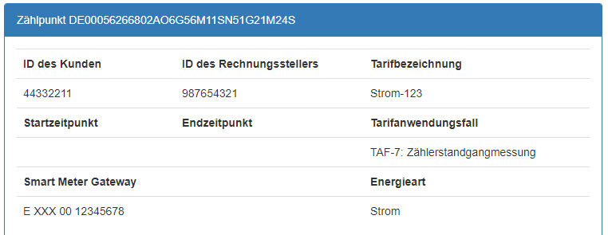

#  Lieferanten-XML

Die Lieferanten-XML-Datei enthält einen ausgerollten Kalender mit Tarifschaltzeiten.

## Beispiel-Dateien

[Beispiel-Lieferanten-XML aus dem Lastenheft (Januar 2017)](Lastenheft/IF_Lieferant_TRuDI_example.xml)

Lieferanten-XML-Datei für Januar 2018:
- [Lieferanten-XML_Jan_2018.xml](Lieferanten-XML/Lieferanten-XML_Jan_2018.xml)

Dazu passende TAF-7-Ablesung:
- [TAF-7-Ablesung_Jan_2018.xml](Lieferanten-XML/TAF-7-Ablesung_Jan_2018.xml)


## XSD-Schema-Dateien

Es werden folgende XSD-Schema-Dateien verwendet:

- [AR_2418-6.xsd](/src/TRuDI.Models/Schemata/AR_2418-6.xsd)
- [espi_derived.xsd](/src/TRuDI.Models/Schemata/espi_derived.xsd)
- [atom.xsd](/src/TRuDI.Models/Schemata/atom.xsd)
- [xml.xsd](/src/TRuDI.Models/Schemata/xml.xsd)

### Anpassen der Beispiel-Dateien

Die Beispiel-Dateien können nicht direkt verwendet werden. Sie müssen angepasst werden,
damit diese zum jeweiligen SMGW passen.

Aus einer TAF-7-Ablesung (Anzeigefunktion) müssen die Angaben zu "Zählpunkt", 
"ID des Rechnungsstellers", "Tarifbezeichnung" und die ID des "Smart Meter Gateway" in 
die Lieferanten-XML-Datei eingetragen werden:



```XML 
<UsagePoints xmlns="http://vde.de/AR_2418-6.xsd" xmlns:xsi="http://www.w3.org/2001/XMLSchema-instance" xsi:schemaLocation="http://vde.de/AR_2418-6.xsd AR_2418-6.xsd" xmlns:espi="http://naesb.org/espi" xmlns:atom="http://www.w3.org/2005/Atom" >
   <UsagePoint>
      <espi:ServiceCategory>
         <espi:kind>0</espi:kind>
      </espi:ServiceCategory>
	
      <!-- Anzupassen: "Zählpunkt" -->
      <usagePointId>DE00056266802AO6G56M11SN51G21M24S</usagePointId>
		
      <InvoicingParty>
         <!-- Anzupassen: "ID des Rechnungsstellers" -->
         <invoicingPartyId>987654321</invoicingPartyId>
      </InvoicingParty>

      <SMGW>
        <!-- Anzupassen: "Smart Meter Gateway", ohne Leerzeichen -->
         <smgwId>EXXX0012345678</smgwId>
      </SMGW>
		
      <!-- Anzupassen: "Tarifbezeichnung" -->
      <tariffName>Strom-123</tariffName>
		
			
      <AnalysisProfile>
         <tariffUseCase>2</tariffUseCase>
         <tariffId>Strom-123</tariffId>
			
         <billingPeriod>
            <!-- 
                Abrechnungsperiode Januar 2018 
                "duration" legt die Länge der Abrechnungsperiode in Sekunden fest:
                   86400 = 1 Tag
                   2678400 = 31 Tage
            -->
            <duration>2678400</duration>
            <start>2018-01-01T00:00:00+01:00</start>
         </billingPeriod>

    <!-- .... -->
``` 

