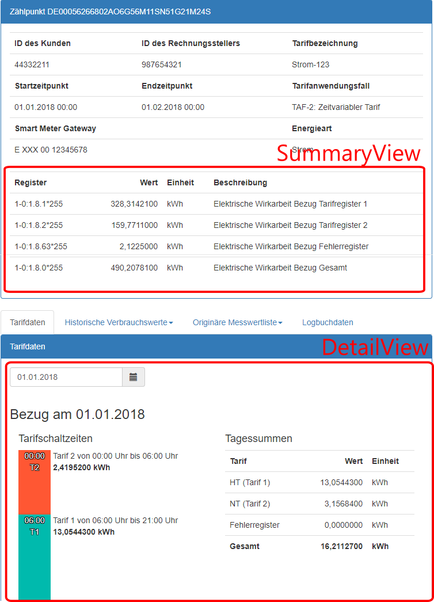

# TRuDI-TAF-Adapter

TAF-Adapter implementieren das Interface ```ITafAdapter``` aus dem Projekt ```TRuDI.TafAdapter.Interface```.

Ein TAF-Adapter liefert neben den berechneten Daten auch jeweils eine View-Komponente für die Zusammenfassung und Detail-Ansicht.

## Erstellen eines neuen HAN-Adapters

Grundsätzlich ist beim Erstellen eines neuen TAF-Adapters genauso vorzugehen, wie bei einem neuen HAN-Adapter.

Folgendes ist jedoch zu beachten:

- Da die Ausgabe/Anzeige der Daten komplett durch den TAF-Adapter erfolgt, muss auch das Programm ``TRuDI.TafAdapter.Test`` 
  angepasst werden, damit dieses eine für den TAF-Adapter passende Ausgabedatei erzeugen kann.

## Einbinden eines neuen TAF-Adapters

Die TAF-Adapter werden über das Projekt TRuDI.TafAdapter.Repository eingebunden. 

In der Klasse 

```csharp
TRuDI.TafAdapter.Repository.TafAdapterRepository
```

muss der neue TAF-Adapter in die Liste ```availableAdapters``` eingetragen werden, z.B.: 

```csharp
new TafAdapterInfo(TafId.Taf1, "Standard Adapter für TAF-1", typeof(TafAdapterTaf1)),
```

## Interface ``ITafAdapter``

Das Interface ``ITafAdapter`` enthält nur die Methode ``Calculate()``. Als Parameter werden die vom SMGW 
abgelesenen Daten sowie die XML-Datei des Lieferanten übergeben. Diese Methode liefert als 
Ergebnis ``TafAdapterData`` zurück:

```csharp
    public class TafAdapterData
    {
        /// <summary>
        /// Gets the type of the summary view component class.
        /// </summary>
        public Type SummaryView { get; }

        /// <summary>
        /// Gets the type of the detail view component class.
        /// </summary>
        public Type DetailView { get; }

        /// <summary>
        /// Gets the calculated TAF data. This object is passed by the backend to the view components.
        /// </summary>
        public ITafData Data { get; }
    }
```

Um möglichst flexibel bei der Anzeige der berechneten Daten zu sein, enthält ``TafAdapterData`` 
die zwei View-Komponenten ``SummaryView`` und ``DetailView``: 



``Data`` hält die berechneten Daten für die Anzeige bereit und wird beim Rendern der Views 
an die jeweilige Komponente übergeben.

Als Beispiel kann hier der bereits vorhandene TAF-2-Adapter dienen.

## TAF-Adapter-Test-Programm

Das Projekt TRuDI.TafAdapter.Test dient als Test-Programm für die TAF-Adapter. Damit können diese über die Kommandozeile aufgerufen werden.

```
Usage: TRuDI.TafAdapter.Test [options]

Options:
  -o|--output <output-file>  Ausgabedatei.
  -d|--data <data-file>      Daten aus dem SMGW.
  -t|--taf <taf-file>        TAF-Datei.
  -? | -h | --help           Show help information
```

### Beispiel

```
dotnet TRuDI.TafAdapter.Test.dll --data taf7-daten.xml --taf tariff-datei-vom-lieferanten.xml --output berechnete-tariff-register.txt
```
